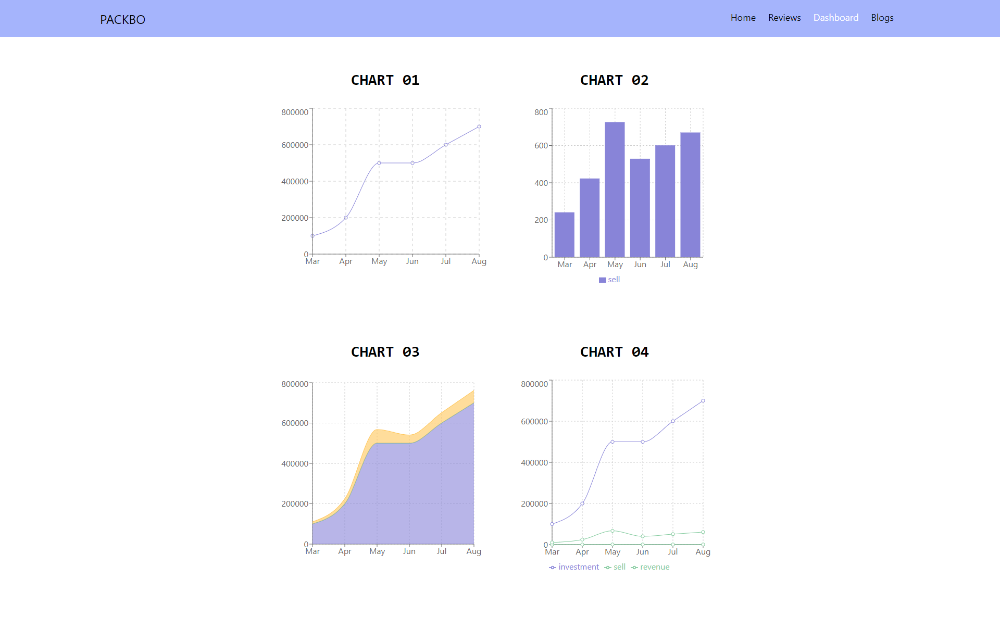
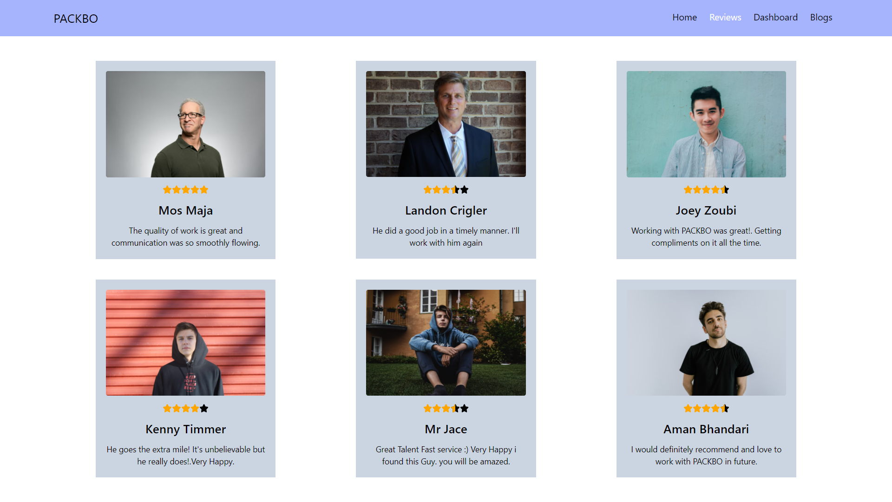
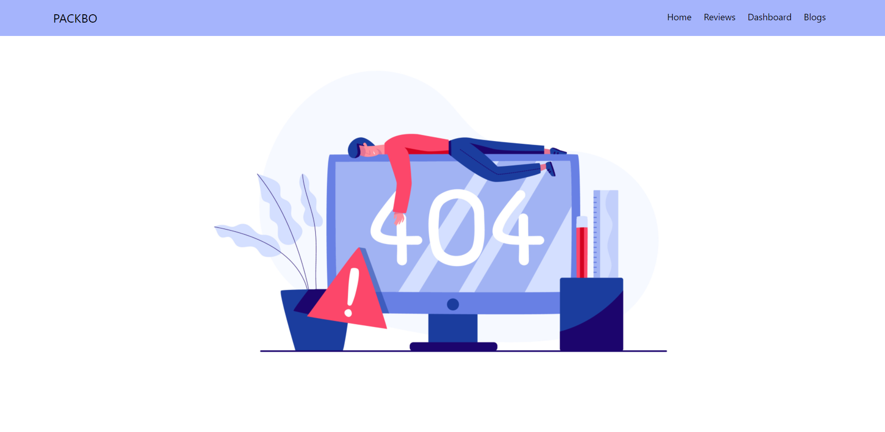

# PACKBO 

Live Link: [PACKBO](https://packbo.netlify.app/).

## Documentation

* This is a marketing agency website.
* Language used in this project
    * HTML
    * CSS
    * JavaScript
* Framework and Library used in this project:     
    * React 
    * React Router
    * Tailwind Css framework 
    * Rechart 
    * HeroIcon 
* Version : 1.000
* Any digital service provider company can take service from this website. 
* In dashboard page there are 4 demo chart for use. 

### Home Page

### DashBoard / Chart Page

### Review Page

### 404 Page

